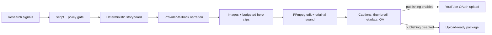

# AtlasForge AI

**A local-first video production system with cost controls, editorial gates, and provider fallbacks.**

[](https://github.com/ReaperXD67/atlasforge-ai/actions/workflows/ci.yml)
[](pyproject.toml)
[](POLICY.md)
[](COSTS.md)

AtlasForge AI is a local-first, production-oriented pipeline that researches, scripts, narrates, storyboards, edits, captions, packages, and can optionally publish one original 6-8 minute YouTube video per day.

It is configured for education-first Atomy content aimed at people researching online business, side hustles, entrepreneurship, wellness, Korean skincare, and productivity. The brand is introduced as one possible case study, never as a guaranteed income or health outcome.

> [!CAUTION]
> AtlasForge AI automates production, not editorial responsibility. Its gates block obvious earnings promises, medical claims, early sales pitches, missing disclosures, and malformed media. You remain responsible for factual accuracy, licensing, product claims, and channel compliance.

## Target architecture


The diagram is the product vision. The repository implements the complete core production path, but it does **not** claim that every box in the diagram ships today. The table below is the source of truth.

| Stage | Status | What ships now | Difference from the target diagram |
| --- | --- | --- | --- |
| 1. Research and topic discovery | Partial | Google Trends RSS, YouTube autocomplete, and Reddit signals with ranked topic candidates | News and competitor-analysis adapters are roadmap items |
| 2. Script generation | Implemented | Gemini, OpenRouter, or local Ollama; structured hook, chapters, body, CTA, sources, and disclosure | SEO is finalized later in the metadata stage |
| 3. Storyboard planner | Implemented | Deterministic scene descriptions, timing, camera, environment, characters, emotion, lighting, SFX, transitions, and prompts | Defaults to 8-24 second scenes with a 32-scene cap, not 50-70 scenes |
| 4. Smart scene scheduler | Implemented | Scores scenes, selects budgeted premium clips, then falls back to local FFmpeg motion | Veo and MiniMax Hailuo are cloud options; "MiniMax H3 local" is not a supported engine |
| 5. Audio pipeline | Implemented | OpenAI TTS, Gemini TTS, local Kokoro, or local Piper; normalization, original music/SFX, ducking, and mixing | Provider choice is configured through fallback order |
| 6. Video composition | Mostly implemented | Scene rendering, cloud-clip normalization, fades, zoom/pan motion, stitching, audio sync, captions, and FFmpeg final render | No semantic AI color-matching pass yet |
| 7. QA and quality control | Partial | Script-policy validation plus duration, file-size, scene-count, chapter, thumbnail, and media checks | AI visual inspection and comprehensive factual/copyright scanning are roadmap items |
| 8. SEO and metadata | Implemented | CTR-oriented title, description, tags, hashtags, chapters/timestamps, category, and disclosures | End-screen suggestions are not generated yet |
| 9. Thumbnail generation | Partial | Automatic 1280x720 local composition from a scene image and generated copy | Flux/Imagen/SD concept generation and CTR ranking are roadmap items |
| 10. Publishing automation | Partial | YouTube OAuth upload, scheduling, privacy, thumbnail, and optional captions | Cards, community posts, and analytics ingestion are roadmap items |

The diagram's PostgreSQL, Redis, cloud-backup, notification, and model-manager boxes are also roadmap items. The current single-workstation design uses SQLite, filesystem artifacts, structured logs, retries, checkpoints, an overlap lock, and per-run cost records. That is simpler and less expensive for one daily job; PostgreSQL and Redis become useful when the system is distributed across multiple workers.

## Actual runtime flow



## Why this architecture

The target diagram proposed "MiniMax H3 running locally" as the standard-scene engine. MiniMax's supported video-generation path is its Hailuo cloud API, while long-form local text-to-video is not practical on an 8 GB laptop GPU. Generating dozens of cloud clips for every episode would also be expensive and fragile.

AtlasForge AI therefore uses:

- free research signals and one structured LLM script call;
- provider fallbacks for text and speech generation;
- Pexels photography or project-owned local editorial cards;
- deterministic FFmpeg motion, pacing, captions, and hardware encoding;
- original procedural ambient music and transition SFX;
- only the configured number of premium Veo or MiniMax clips, behind a hard daily USD budget;
- checkpointed artifacts and SQLite state so failed runs resume instead of restarting.

## Run artifacts

Every run is self-contained:

```text
output/YYYY-MM-DD-run-id/
|-- research/       topic candidates and source notes
|-- scripts/        structured script and narration text
|-- storyboards/    original and voice-retimed scene plans
|-- audio/          provider chunks, normalized voice, final mix
|-- scenes/         source images and license/provenance records
|-- videos/         scene renders and optional premium clips
|-- music/          locally generated original music
|-- sfx/            locally generated transition effects
|-- subtitles/      SRT, animated ASS, timing JSON
|-- thumbnails/     1280x720 thumbnail
|-- metadata/       title, description, tags, chapters, QA report
|-- final/          upload-ready MP4
|-- logs/           structured JSON logs
`-- manifest.json   status, costs, warnings, output locations
```

## Quick start

On Windows PowerShell:

```powershell
git clone https://github.com/ReaperXD67/atlasforge-ai.git
Set-Location atlasforge-ai
Set-ExecutionPolicy -Scope Process Bypass
.\scripts\install.ps1
Copy-Item .env.example .env
notepad .env
.\.venv\Scripts\atlasforge.exe doctor
.\.venv\Scripts\atlasforge.exe run --no-upload
```

The installer does not create API credentials or enable billing. Complete [SETUP.md](SETUP.md) before the first production run.

## Commands

```powershell
atlasforge doctor                         # no API calls or credit usage
atlasforge run --no-upload                # build today's package, do not upload
atlasforge run --topic "A realistic side hustle framework"
atlasforge youtube-auth                   # one-time browser OAuth
atlasforge run --upload                   # package and upload/schedule
atlasforge schedule                       # persistent daily scheduler
atlasforge dashboard --port 8741          # local progress UI
```

The former `dailyvideo` command remains available as a backward-compatible alias. For unattended Windows operation, run `scripts/register_task.ps1` after a successful dry run.

## Safety defaults

- YouTube publishing is disabled.
- Premium video generation is disabled.
- Upload privacy is `private`.
- Realistic synthetic media is declared through `status.containsSyntheticMedia`.
- API keys and OAuth tokens live in ignored local files.
- Generated media and models are not committed.
- One SQLite lock prevents overlapping daily runs.
- A failed provider falls through; a failed compliance or media-quality gate stops publishing.

## Documentation

- [Fresh Windows setup](SETUP.md)
- [Architecture and extension points](ARCHITECTURE.md)
- [Cost model](COSTS.md)
- [YouTube and claims policy](POLICY.md)
- [Contributing](CONTRIBUTING.md)

## Official references

The implementation follows the official documentation for [OpenAI text-to-speech](https://developers.openai.com/api/docs/guides/text-to-speech), [Gemini TTS](https://ai.google.dev/gemini-api/docs/speech-generation), [Veo video generation](https://ai.google.dev/gemini-api/docs/veo), [MiniMax video generation](https://platform.minimax.io/docs/guides/video-generation), [YouTube video resources](https://developers.google.com/youtube/v3/docs/videos), and [YouTube altered/synthetic content disclosure](https://support.google.com/youtube/answer/14328491).

## License

MIT. Atomy is a trademark of its respective owner. This project is independent and is not endorsed by or affiliated with Atomy.
