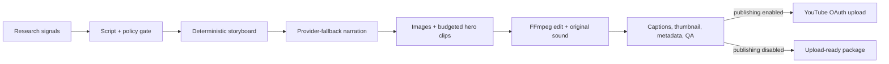

# Daily Video Factory

A local-first, production-oriented pipeline that researches, scripts, narrates, storyboards, edits, captions, packages, and optionally uploads one original 6–8 minute YouTube video per day.

It is configured for education-first Atomy content aimed at people researching online business, side hustles, entrepreneurship, wellness, Korean skincare, and productivity. The brand is deliberately introduced as one possible case study—never as a guaranteed income or health outcome.

> This repository automates production, not editorial responsibility. Its quality gates block obvious earnings promises, medical claims, early sales pitches, missing disclosures, and malformed media. You remain responsible for factual accuracy, product claims, licensing, and channel compliance.

## Why this architecture

The original brief proposed “MiniMax H3 running locally” as the main video engine. MiniMax's documented video models are cloud API models (currently Hailuo), not an appropriate local text-to-video workload for an 8 GB RTX 4070 laptop. Generating 45–60 cloud clips for every long-form video would also be expensive and fragile.

Daily Video Factory therefore uses:

- free research signals from Google Trends RSS, YouTube autocomplete, and Reddit;
- Gemini, OpenRouter, or local Ollama for one structured script call;
- OpenAI TTS, Gemini TTS, local Kokoro, or local Piper for narration;
- Pexels photography or locally generated project-owned editorial cards;
- deterministic FFmpeg motion, pacing, captions, color, audio mixing, and NVENC encoding;
- original procedural ambient music and transition SFX with no third-party music rights dependency;
- at most the configured number of premium Veo or MiniMax hero clips, behind a hard daily USD budget;
- checkpointed artifacts and SQLite state so failed runs resume instead of starting over.

## Pipeline



Every run contains:

```text
output/YYYY-MM-DD-run-id/
├── research/       topic candidates and source notes
├── scripts/        structured script and narration text
├── storyboards/    original and voice-retimed scene plans
├── audio/          provider chunks, normalized voice, final mix
├── scenes/         source images and license/attribution records
├── videos/         scene renders and premium clips
├── music/          locally generated original music
├── sfx/            locally generated transition effects
├── subtitles/      SRT, animated ASS, timing JSON
├── thumbnails/     1280×720 thumbnail
├── metadata/       title, description, tags, chapters, QA report
├── final/          upload-ready MP4
├── logs/           structured JSON logs
└── manifest.json   status, costs, warnings, output locations
```

## Quick start

On Windows PowerShell:

```powershell
git clone https://github.com/ReaperXD67/daily-video-factory.git
Set-Location daily-video-factory
Set-ExecutionPolicy -Scope Process Bypass
.\scripts\install.ps1
Copy-Item .env.example .env
notepad .env
.\.venv\Scripts\dailyvideo.exe doctor
.\.venv\Scripts\dailyvideo.exe run --no-upload
```

The installer does not create API credentials or enable billing. Complete [SETUP.md](SETUP.md) before the first production run.

## Commands

```powershell
dailyvideo doctor                         # no API calls or credit usage
dailyvideo run --no-upload                # build today's package, do not upload
dailyvideo run --topic "A realistic side hustle framework"
dailyvideo youtube-auth                   # one-time browser OAuth
dailyvideo run --upload                   # package and upload/schedule
dailyvideo schedule                       # persistent daily scheduler
dailyvideo dashboard --port 8741          # local progress UI
```

For unattended Windows operation, run `scripts/register_task.ps1` after a successful dry run.

## Safety defaults

- YouTube publishing is disabled.
- Premium video generation is disabled.
- Upload privacy is `private`.
- Realistic synthetic media is declared through `status.containsSyntheticMedia`.
- API keys and OAuth tokens live in ignored local files.
- Generated media and models are not committed.
- One SQLite lock prevents overlapping daily runs.
- A failed provider falls through; a failed compliance or media quality gate stops publishing.

## Documentation

- [Fresh Windows setup](SETUP.md)
- [Architecture and extension points](ARCHITECTURE.md)
- [Cost model](COSTS.md)
- [YouTube and claims policy](POLICY.md)
- [Contributing](CONTRIBUTING.md)

## Current-source notes

The implementation follows the current official documentation for [OpenAI text-to-speech](https://developers.openai.com/api/docs/guides/text-to-speech), [Gemini TTS](https://ai.google.dev/gemini-api/docs/speech-generation), [Veo video generation](https://ai.google.dev/gemini-api/docs/veo), [MiniMax video generation](https://platform.minimax.io/docs/guides/video-generation), [YouTube video resources](https://developers.google.com/youtube/v3/docs/videos), and [YouTube altered/synthetic content disclosure](https://support.google.com/youtube/answer/14328491).

## License

MIT. Atomy is a trademark of its respective owner. This project is independent and is not endorsed by or affiliated with Atomy.

