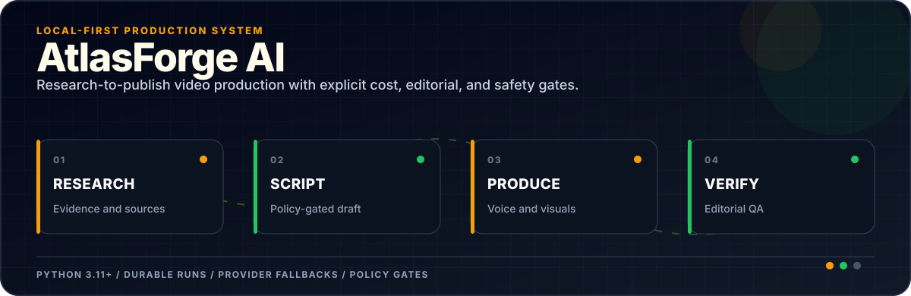
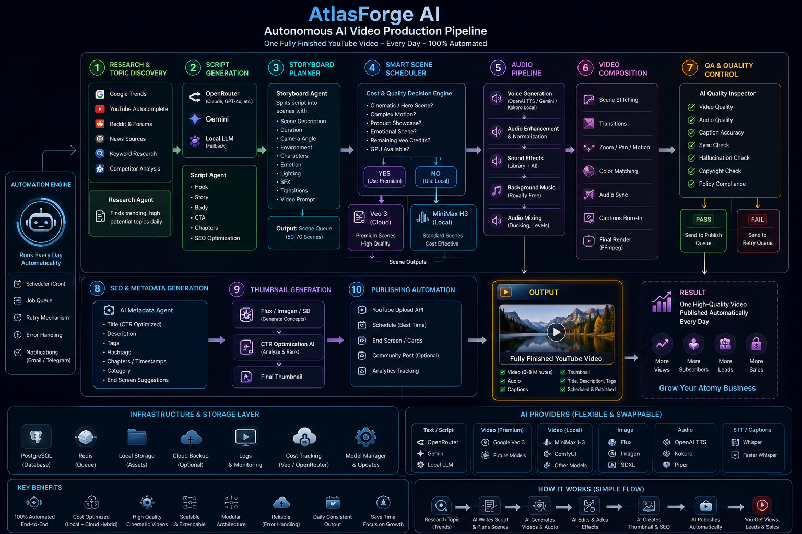
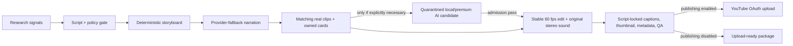

<div align="center">



</div>

**A local-first video production system with cost controls, editorial gates, and provider fallbacks.**

[](https://github.com/ReaperXD67/atlasforge-ai/actions/workflows/ci.yml)
[](pyproject.toml)
[](POLICY.md)
[](COSTS.md)

AtlasForge AI is a local-first, production-oriented pipeline that researches, scripts, narrates, storyboards, edits, captions, packages, and can optionally publish one original 6-8 minute YouTube video per day.

It also includes a separate **Remotion Music Film** workspace: upload a song, analyze its beat and
energy map locally, preview deterministic beat-reactive graphics, then build a faceless racing/event
film from CLIP-ranked real footage, with synthetic inserts isolated behind admission. See
[Remotion Music Film workflow](docs/MUSIC_VIDEO.md).

The third workspace, **AI Viral Lab**, creates coherent 3–10 second vertical AI-native shots:
reference-led character performances synchronized to an uploaded song, native-audio fictional
dialogue, and physically plausible fictional spectacles. It includes a free Wan 2.2 lane for the
8 GB RTX 4070 and opt-in Gemini Omni/Veo lanes. See [AI Viral Lab](docs/VIRAL_SHORTS.md).

The separate **AI Generation** workspace is an isolated candidate workshop for cars, products,
environments, and other shots that cannot be sourced honestly. It starts from a real photographic
plate when possible, generates 1–3 seeds, and quarantines every result until technical and
OpenRouter vision checks approve it. Generated footage is never inserted merely because it exists.

It is configured for education-first Atomy content aimed at people researching online business, side hustles, entrepreneurship, wellness, Korean skincare, and productivity. The brand is introduced as one possible case study, never as a guaranteed income or health outcome.

> [!CAUTION]
> AtlasForge AI automates production, not editorial responsibility. Its gates block obvious earnings promises, medical claims, early sales pitches, missing disclosures, and malformed media. You remain responsible for factual accuracy, licensing, product claims, and channel compliance.

## Target architecture



The diagram is the product vision. The repository implements the complete core production path, but it does **not** claim that every box in the diagram ships today. The table below is the source of truth.

| Stage | Status | What ships now | Difference from the target diagram |
| --- | --- | --- | --- |
| 1. Research and topic discovery | Implemented | Rotating Atomy editorial calendar, pinned official/regulatory source pack, Google Trends RSS, YouTube autocomplete, and Reddit audience signals | Source summaries intentionally require a periodic human refresh |
| 2. Script generation | Implemented | Gemini, OpenRouter, or local Ollama; structured hook, chapters, body, CTA, sources, and disclosure | SEO is finalized later in the metadata stage |
| 3. Storyboard planner | Implemented | Concrete shot briefs, timing, camera, environment, characters, emotion, lighting, SFX, transitions, and prompts | Defaults to 5-14 second scenes with a 48-scene cap |
| 4. Smart scene scheduler | Implemented | Routes exact facts to owned information cards, searches locally CLIP-ranked creator-diverse Pexels clips first, then considers premium or explicitly necessary local AI | Local AI remains a last resort and must pass admission |
| 5. Audio pipeline | Implemented | OpenAI TTS, Gemini TTS, local Kokoro, or local Piper; normalization, original stereo documentary score/SFX, ducking, and mixing | Provider choice is configured through fallback order |
| 6. Video composition | Implemented | Real-clip trims, subtle color matching, stable supersampled still motion, local RIFE neural interpolation, 60 fps crossfades, audio sync, script-locked captions, runtime-probed GPU encoding, and FFmpeg final render | Editorial suitability still benefits from a final human watch |
| 7. QA and quality control | Partial | Script-policy validation, media checks, deterministic synthetic-clip metrics, and an OpenRouter contact-sheet realism supervisor | Comprehensive factual and copyright scanning remain roadmap items |
| 8. SEO and metadata | Implemented | CTR-oriented title, description, tags, hashtags, chapters/timestamps, category, and disclosures | End-screen suggestions are not generated yet |
| 9. Thumbnail generation | Partial | Automatic 1280x720 local composition from a scene image and generated copy | Flux/Imagen/SD concept generation and CTR ranking are roadmap items |
| 10. Publishing automation | Partial | YouTube OAuth upload, scheduling, privacy, thumbnail, and optional captions | Cards, community posts, and analytics ingestion are roadmap items |

The diagram's PostgreSQL, Redis, cloud-backup, notification, and model-manager boxes are also roadmap items. The current single-workstation design uses SQLite, filesystem artifacts, structured logs, retries, checkpoints, an overlap lock, and per-run cost records. That is simpler and less expensive for one daily job; PostgreSQL and Redis become useful when the system is distributed across multiple workers. Docker profiles now provide CPU-safe, GPU-render, and fully local Ollama execution without introducing distributed infrastructure.

## Actual runtime flow



## Why this architecture

The target diagram proposed "MiniMax H3 running locally" as the standard-scene engine. MiniMax's supported video-generation path is its Hailuo cloud API. AtlasForge instead uses the official Wan 2.2 TI2V 5B ComfyUI workflow for a small number of local generated shots. Making every second with diffusion would still be impractically slow and visually inconsistent on an 8 GB laptop GPU, so real footage carries most of the edit.

AtlasForge AI therefore uses:

- free research signals and one structured LLM script call;
- a rotating Atomy onboarding curriculum grounded in locally pinned official U.S. and FTC sources;
- provider fallbacks for text and speech generation;
- unique Pexels Video b-roll chosen from concrete action-oriented shot briefs and locally reranked from thumbnail content with OpenAI CLIP;
- Wan 2.2 TI2V 5B only for an explicitly necessary shot, generated best-of-N and rejected when its
  geometry, physics, continuity, exposure, sharpness, or reference fidelity fails admission;
- project-owned information cards and rock-steady supersampled still motion as fallbacks;
- Whisper timing anchored to the exact approved script, so brand spelling never comes from ASR;
- a locally synthesized stereo documentary score, scene accents, sidechain ducking, and transition SFX;
- only the configured number of premium Veo or MiniMax clips, behind a hard daily USD budget;
- checkpointed artifacts and SQLite state so failed runs resume instead of restarting.

## Run artifacts

Every run is self-contained:

```text
output/YYYY-MM-DD-run-id/
|-- research/       topic candidates and source notes
|-- scripts/        structured script and narration text
|-- storyboards/    original and voice-retimed scene plans
|-- audio/          provider chunks, normalized voice, final mix
|-- scenes/         source images, owned cards, and license/provenance records
|-- videos/         Pexels clips, local-AI shots, normalized scenes, and optional premium clips
|-- music/          locally generated original music
|-- sfx/            locally generated transition effects
|-- subtitles/      SRT, animated ASS, timing JSON
|-- thumbnails/     1280x720 thumbnail
|-- metadata/       title, description, tags, chapters, QA report
|-- final/          upload-ready MP4
|-- logs/           structured JSON logs
`-- manifest.json   status, costs, warnings, output locations
```

## Quick start

The lowest-effort path on Windows uses Docker Desktop, your OpenRouter key, free local Kokoro
narration, script-locked Whisper timing, Pexels stock video, and the RTX 4070 for 1080p60 NVENC.
Publishing and paid video generation stay off.

```powershell
git clone https://github.com/ReaperXD67/atlasforge-ai.git
Set-Location atlasforge-ai
Copy-Item .env.example .env
notepad .env # paste OPENROUTER_API_KEY; PEXELS_API_KEY is recommended
.\scripts\start_studio.ps1
```

For the optional quarantined AI Generation workspace, run this once before starting Studio. It installs
an isolated CUDA ComfyUI runtime plus Wan 2.2 TI2V 5B, SDXL 1.0 first-frame generation, and RIFE
4.26 neural frame interpolation under
`%LOCALAPPDATA%\AtlasForge\ComfyUI`:

```powershell
.\scripts\install_comfyui_wan22.ps1
```

After installation, `start_studio.ps1` starts the local video API automatically. Editorial films do
not depend on it: real clips and owned fallbacks continue to work if Wan is disabled, busy, rejected,
or unavailable.

Open `http://127.0.0.1:8741`, select **Atomy USA — Fast Preview** for the first run, and click
**Generate film**. Stop the service later with `.\scripts\stop_studio.ps1`. The first build installs
the local voice/caption stack; the first generation can also download model data into `models/`.

For a native Python installation instead:

```powershell
git clone https://github.com/ReaperXD67/atlasforge-ai.git
Set-Location atlasforge-ai
Set-ExecutionPolicy -Scope Process Bypass
.\scripts\install.ps1
Copy-Item .env.example .env
notepad .env
.\.venv\Scripts\atlasforge.exe doctor
.\.venv\Scripts\atlasforge.exe run --no-upload
```

The installer does not create API credentials or enable billing. Complete [SETUP.md](SETUP.md) before the first production run.

For all container modes and diagnostics, see [Local and Docker operation](docs/LOCAL_DOCKER.md).

## Commands

```powershell
atlasforge doctor                         # no API calls or credit usage
atlasforge run --no-upload                # build today's package, do not upload
atlasforge run --topic "A realistic side hustle framework"
atlasforge youtube-auth                   # one-time browser OAuth
atlasforge run --upload                   # package and upload/schedule
atlasforge schedule                       # persistent daily scheduler
atlasforge dashboard --port 8741          # local progress UI
atlasforge music-film --track song.mp3 --title "Sepang Track Experience" --seconds 60
atlasforge viral-film --recipe beat_creature --concept "A cat dances in a pit garage" --provider local_wan --reference cat.png --track song.mp3 --seconds 5
atlasforge viral-film --recipe cinematic_insert --concept "An unbranded GT car stays parked while light rain moves" --provider local_wan --seconds 5 --candidates 2
```

The Studio adds reusable use-case profiles, editable scenes, a multitrack timeline, live provider
readiness, generation logs, cancel controls, and direct playback of completed local renders.

The former `dailyvideo` command remains available as a backward-compatible alias. For unattended Windows operation, run `scripts/register_task.ps1` after a successful dry run.

## Safety defaults

- YouTube publishing is disabled.
- Premium video generation is disabled.
- Upload privacy is `private`.
- Realistic synthetic media is declared through `status.containsSyntheticMedia`.
- API keys and OAuth tokens live in ignored local files.
- Generated media and models are not committed.
- One SQLite lock prevents overlapping daily runs.
- A failed provider falls through; a failed compliance or media-quality gate stops publishing.
- A rejected synthetic clip remains inspectable in its run folder but is not admitted to editorial.

## Documentation

- [Fresh Windows setup](SETUP.md)
- [Architecture and extension points](ARCHITECTURE.md)
- [Cost model](COSTS.md)
- [AI Viral Lab](docs/VIRAL_SHORTS.md)
- [YouTube and claims policy](POLICY.md)
- [Contributing](CONTRIBUTING.md)

## Official references

The implementation follows the official documentation for [Pexels API](https://www.pexels.com/api/documentation/), [OpenAI CLIP](https://github.com/openai/CLIP), [VBench](https://github.com/Vchitect/VBench), [DOVER](https://github.com/VQAssessment/DOVER), [SDXL 1.0](https://github.com/Stability-AI/generative-models), [ComfyUI image upscaling and enhancement](https://docs.comfy.org/tutorials/utility/image-upscale), [ComfyUI Wan 2.2](https://docs.comfy.org/tutorials/video/wan/wan2_2), [Wan 2.2](https://github.com/Wan-Video/Wan2.2), [RIFE](https://github.com/hzwer/ECCV2022-RIFE), [faster-whisper](https://github.com/SYSTRAN/faster-whisper), [OpenRouter chat completions](https://openrouter.ai/docs/api/api-reference/chat/send-chat-completion-request), [OpenAI text-to-speech](https://developers.openai.com/api/docs/guides/text-to-speech), [Gemini TTS](https://ai.google.dev/gemini-api/docs/speech-generation), [Gemini Omni video](https://ai.google.dev/gemini-api/docs/omni), [Veo video generation](https://ai.google.dev/gemini-api/docs/veo), [MiniMax video generation](https://platform.minimax.io/docs/guides/video-generation), [YouTube video resources](https://developers.google.com/youtube/v3/docs/videos), and [YouTube altered/synthetic content disclosure](https://support.google.com/youtube/answer/14328491).

## License

MIT. Atomy is a trademark of its respective owner. This project is independent and is not endorsed by or affiliated with Atomy.
